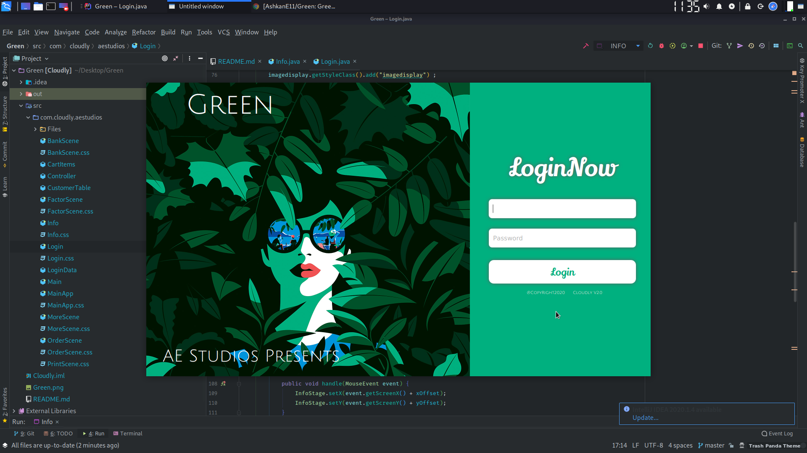

 

# Green

 

Green, is a nice accounting conformity for inventory management roles and Functions. 
Green is a further intelligent form of way and easement for administration and tiny corporations 
which wants to get more widely and extensively acquainted by their business statics and attachments.

 

 

# Featuring

-- Page Instructs &&& Hints  
-- Source Based Login Form  
-- Items &&& Customers Organizing  
-- Printing Cart Items  
-- Cheque Organizer &&& Scheduler  

# Disclaimer

Green is provided by Ashkan Ebtekari "as is" and "with all faults". The provider makes no representations or warranties of any kind concerning
the safety, suitability, lack of viruses, inaccuracies, typographical errors, or other harmful components of this software.
There are inherent dangers in the use of any
software, and you are solely responsible for determining whether Green is compatible with your equipment and other software installed on your equipment.
You are also solely responsible for the protection of your equipment and backup of your data, and the provider will not be liable for any damages
you may suffer in connection with using, modifying, or distributing this software.

# License

Copyright 2019 Ashkan Ebtekari

Permission is hereby granted, free of charge, to any person obtaining a copy of this software and associated documentation files (the "Software"), to deal in the Software without restriction, including without limitation the rights to use, copy, modify, merge, publish, distribute, sublicense, and/or sell copies of the Software, and to permit persons to whom the Software is furnished to do so, subject to the following conditions:

The above copyright notice and this permission notice shall be included in all copies or substantial portions of the Software.

THE SOFTWARE IS PROVIDED "AS IS", WITHOUT WARRANTY OF ANY KIND, EXPRESS OR IMPLIED, INCLUDING BUT NOT LIMITED TO THE WARRANTIES OF MERCHANTABILITY, FITNESS FOR A PARTICULAR PURPOSE AND NONINFRINGEMENT. IN NO EVENT SHALL THE AUTHORS OR COPYRIGHT HOLDERS BE LIABLE FOR ANY CLAIM, DAMAGES OR OTHER LIABILITY, WHETHER IN AN ACTION OF CONTRACT, TORT OR OTHERWISE, ARISING FROM, OUT OF OR IN CONNECTION WITH THE SOFTWARE OR THE USE OR OTHER DEALINGS IN THE SOFTWARE.

# Tools

! Java8  
! JDK8  
! CSS  
! Printer  

# Login

*** Username: Boss  
*** Password: Boss  
